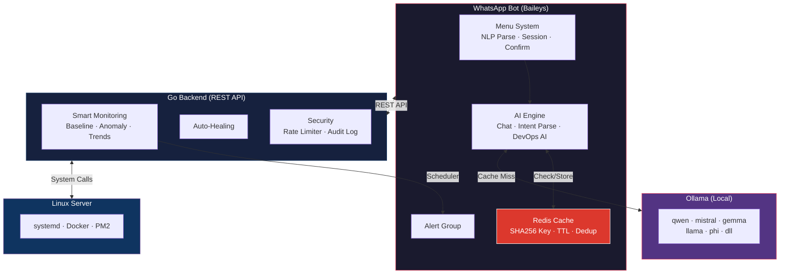

# WhatsApp DevOps Assistant

[](https://github.com/fahmiajik12/whatsapp-bot-server-monitor)
[](https://go.dev)
[](https://nodejs.org)
[](https://ollama.com)
[](https://redis.io)
[](LICENSE)

**AI-Driven DevOps Assistant Berbasis WhatsApp Bot** — monitoring, automation, AI assistant, dan manajemen server Linux tanpa web dashboard. AI berjalan **100% lokal** menggunakan [Ollama](https://ollama.com) — tanpa cloud, tanpa limit, tanpa biaya. Dibangun dengan arsitektur modular menggunakan [Baileys](https://github.com/WhiskeySockets/Baileys) (Node.js) + Go Backend.

## Arsitektur



## Fitur Utama

### 🧠 AI Assistant (Ollama — 100% Lokal)
- **Chatbot umum** — Jawab pertanyaan apapun seperti ChatGPT, ngobrol santai, tanya coding, sains, dll
- **DevOps AI** — Analisis server, diagnosa masalah, rekomendasi solusi berdasarkan data real-time
- **Intent Parsing** — Paham bahasa natural ("kenapa apache mati" → otomatis ke command yang tepat)
- **Multi-model** — Support semua model Ollama (Qwen, Mistral, Gemma, Llama, Phi, dll)
- **Model Manager** — Download, ganti, dan hapus model AI langsung dari WhatsApp (`/aimodel`)
- **Zero Cost & Zero Limit** — Berjalan 100% lokal, tidak perlu API key cloud, tanpa batas request

### ⚡ Redis Cache Layer
- **AI Response Cache** — Cache response AI untuk menghindari request berulang ke Ollama
- **SHA256 Key Generation** — Hash prompt untuk cache key yang konsisten
- **Request Deduplication** — Jika prompt yang sama sedang diproses, tunggu hasilnya
- **Configurable TTL** — Chat (10 menit), DevOps (5 menit), Intent (30 menit)
- **Graceful Fallback** — Jika Redis down, bot tetap berjalan normal tanpa cache
- **Cache Statistics** — Monitoring hit/miss rate via `/cache` command

### 🖥️ Interactive Menu System
- Menu interaktif via WhatsApp (balas dengan angka)
- Navigasi: `0` = kembali, `home` = menu utama
- Konfirmasi untuk aksi berbahaya (restart, stop, kill)
- Tetap support command manual (`/status`, `/restart`)

### 📊 Smart Monitoring Engine
- **Baseline** — Moving average untuk deteksi pola normal
- **Anomaly Detection** — Deteksi spike otomatis berdasarkan deviasi dari baseline
- **Trend Analysis** — Prediksi penggunaan resource ke depan
- **Smart Alert** — Alert cerdas dengan analisis konteks, bukan hanya threshold

### 🤖 Auto-Healing (Automation)
- Aturan otomatis: jika service down → restart
- Kondisi: `service_down`, `cpu_above`, `ram_above`, `disk_above`
- Cooldown & batas aksi per jam untuk mencegah loop
- Riwayat eksekusi lengkap

### 🔐 Security
- Whitelist nomor telepon
- Role-based access (superadmin > admin > user)
- Rate limiter per API key (token bucket)
- Audit log untuk setiap command
- Konfirmasi wajib untuk aksi berbahaya
- Filter grup WhatsApp (hanya grup yang diizinkan)

### 🔌 Plugin System
- Arsitektur modular, mudah tambah fitur baru
- Support plugin publik & privat (private/ di-gitignore)
- Hot-reload: restart bot untuk load plugin baru

### 🖥️ Multi-Server Support
- Kelola banyak server dari satu bot WhatsApp
- Tentukan target server di command: `/status staging`
- Konfigurasi per-server dengan API key masing-masing

## Quick Start

### 1. Clone & Setup

```bash
git clone https://github.com/fahmiajik12/whatsapp-bot-server-monitor.git
cd whatsapp-bot-server-monitor
chmod +x setup.sh
./setup.sh
```

### 2. Konfigurasi

Salin template config:
```bash
cp bot/config.example.json bot/config.json
cp backend/config.example.json backend/config.json
```

Edit `bot/config.json`:
```json
{
  "backendUrl": "http://localhost:1111",
  "apiKey": "your-secret-api-key",
  "ollama": {
    "host": "localhost",
    "port": 11434,
    "model": "qwen2.5:1.5b"
  },
  "prefix": "/",

  "adminNumbers": {
    "628xxxxxxxxxx": "superadmin",
    "628xxxxxxxxxx": "admin"
  },

  "alertGroupId": "",
  "alertGroupName": "Server Monitor",

  "servers": {
    "local": {
      "name": "Server Utama",
      "url": "http://localhost:1111",
      "apiKey": "your-secret-api-key",
      "isLocal": true,
      "default": true
    }
  },

  "alert": {
    "enabled": true,
    "intervalSeconds": 60,
    "cooldownSeconds": 300,
    "thresholds": { "cpu": 80, "ram": 90, "disk": 90 },
    "smartAnalysis": true
  },

  "automation": {
    "enabled": true,
    "evaluationIntervalSeconds": 30,
    "maxActionsPerHour": 10
  },

  "security": {
    "rateLimitPerMinute": 30,
    "commandCooldownSeconds": 2,
    "requireConfirmation": ["restart", "stop", "kill"],
    "auditEnabled": true
  },

  "modules": {
    "monitoring": true,
    "service": true,
    "apache": true,
    "process": true,
    "logs": true,
    "auth": true,
    "alert": true,
    "tools": true,
    "menu": true,
    "automation": true,
    "settings": true,
    "ai": true
  },

  "plugins": {},

  "ui": {
    "language": "id",
    "menuStyle": "numbered",
    "sessionTimeoutMinutes": 10,
    "confirmDangerousActions": true
  }
}
```

Edit `backend/config.json`:
```json
{
  "port": ":1111",
  "apiKey": "your-secret-api-key",
  "allowedServices": [],
  "logTailLines": 50,
  "monitoring": {
    "baselineWindow": 60,
    "baselineSamplingSeconds": 60,
    "spikeMultiplier": 1.5,
    "trendPredictionDays": 7
  },
  "automation": {
    "enabled": true,
    "evaluationIntervalSeconds": 30,
    "maxActionsPerHour": 10
  },
  "security": {
    "rateLimitPerMinute": 60,
    "auditEnabled": true
  }
}
```

> **Catatan:**
> - `apiKey` harus **sama** di kedua file dan di setiap entry `servers`
> - `allowedServices` kosong `[]` = auto-detect dari sistem
> - `adminNumbers` format: `628xxxxxxxxxx` (kode negara tanpa `+` atau `0`)
> - `alertGroupId` kosong = bot akan otomatis membuat grup baru saat pertama konek

### 3. Build Backend

```bash
cd backend
go build -o wabot-backend ./cmd
```

### 4. Jalankan

**Manual (development):**

```bash
# Terminal 1 - Backend
cd backend && ./wabot-backend

# Terminal 2 - Bot
cd bot && node index.js
```

**PM2 (production):**

```bash
pm2 start ecosystem.config.js
pm2 save
```

### 5. Scan QR Code

Scan QR code yang muncul di terminal dengan WhatsApp:
1. Buka WhatsApp di HP
2. Menu > **Linked Devices** > **Link a Device**
3. Scan QR code

> **Penting:** Jalankan bot secara manual (`node index.js`) saat scan pertama kali, karena PM2 menambahkan timestamp yang merusak tampilan QR code.

## Menu Interaktif

Setelah terhubung, ketik `/menu` untuk membuka menu utama:

```
🖥️ DevOps Assistant
━━━━━━━━━━━━━━━━━━

1️⃣ 📊 Monitoring
2️⃣ ⚙️ Service Manager
3️⃣ 📋 Logs
4️⃣ 🔧 Tools
5️⃣ 🤖 Automation
6️⃣ ⚡ Quick Actions
7️⃣ ⚙️ Settings

Balas dengan angka atau ketik /help
```

Navigasi menu:
- Balas **angka** untuk memilih
- Balas **0** untuk kembali
- Ketik **home** untuk ke menu utama
- Ketik **batal** untuk membatalkan aksi

## Daftar Command

### 📊 Monitoring

| Command | Permission | Deskripsi |
|---------|------------|-----------|
| `/status` | user | CPU, RAM, Swap, GPU/VRAM, Disk, Uptime |
| `/services` | user | Status semua service |
| `/anomaly` | user | Anomali yang terdeteksi |
| `/baseline` | admin | Data baseline monitoring |
| `/trends` | user | Tren & prediksi resource |

### ⚙️ Service Management

| Command | Permission | Deskripsi |
|---------|------------|-----------|
| `/service <nama>` | admin | Status satu service |
| `/start <nama>` | admin | Start service |
| `/stop <nama>` | admin | Stop service (butuh konfirmasi) |
| `/restart <nama>` | admin | Restart service (butuh konfirmasi) |

### 🌐 Apache

| Command | Permission | Deskripsi |
|---------|------------|-----------|
| `/web status` | admin | Status Apache |
| `/web restart` | admin | Restart Apache |
| `/web reload` | admin | Reload config |
| `/web configtest` | admin | Test konfigurasi |
| `/web vhost` | admin | Daftar virtual host |

### 🔧 Tools

| Command | Permission | Deskripsi |
|---------|------------|-----------|
| `/pm2` | admin | PM2 process list |
| `/docker` | admin | Docker containers aktif |
| `/docker images` | admin | Docker images |
| `/docker stats` | admin | Docker resource usage |
| `/df` | user | Disk usage |
| `/free` | user | Memory usage |
| `/uptime` | user | Server uptime & load |
| `/who` | admin | User yang sedang login (SSH) |
| `/top` | admin | Top proses (by CPU) |
| `/ports` | admin | Port yang terbuka |
| `/ip` | admin | IP address server |
| `/tools` | user | Daftar semua tools |

### 🤖 Automation

| Command | Permission | Deskripsi |
|---------|------------|-----------|
| `/auto` | admin | Lihat aturan automation |
| `/auto enable <id>` | admin | Aktifkan aturan |
| `/auto disable <id>` | admin | Nonaktifkan aturan |
| `/auto history` | admin | Riwayat eksekusi |

### ⚙️ Settings & Admin

| Command | Permission | Deskripsi |
|---------|------------|-----------|
| `/settings` | admin | Lihat konfigurasi aktif |
| `/settings set <key> <value>` | superadmin | Ubah pengaturan |
| `/audit [count]` | admin | Lihat audit log |
| `/adduser <nomor> [role]` | superadmin | Tambah user |
| `/removeuser <nomor>` | superadmin | Hapus user |
| `/listusers` | admin | Daftar user terdaftar |
| `/menu` | user | Buka menu interaktif |
| `/servers` | user | Daftar server |
| `/help` | user | Daftar command |

### 🔔 Alert

| Command | Permission | Deskripsi |
|---------|------------|-----------|
| `/alert on` | admin | Aktifkan alert |
| `/alert off` | admin | Nonaktifkan alert |
| `/alert status` | admin | Status alert |

### 🧠 AI Assistant

| Command | Permission | Deskripsi |
|---------|------------|-----------|
| `/chat <pesan>` | user | Ngobrol dengan AI (seperti ChatGPT) |
| `/analyze <target>` | admin | AI analisis mendalam (cpu/ram/disk) |
| `/why <issue>` | admin | Tanya AI penyebab masalah |
| `/fix <issue>` | admin | Tanya AI cara memperbaiki |
| `/aimodel` | superadmin | Lihat status & daftar model AI |
| `/aimodel use <nama>` | superadmin | Ganti model AI aktif |
| `/aimodel pull <nama>` | superadmin | Download model AI baru |
| `/aimodel rm <nama>` | superadmin | Hapus model AI |
| `/cache` | admin | Statistik cache Redis (hit/miss, memory) |
| `/cache clear` | admin | Hapus semua cache AI |

> **Tanpa command:** Auto-reply AI hanya aktif pada chat yang diproses router bot. Pada konfigurasi saat ini, ini biasanya berarti pesan biasa di **grup alert** yang sesuai `alertGroupId`, bukan otomatis di semua chat pribadi.

### Lainnya

| Command | Permission | Deskripsi |
|---------|------------|-----------|
| `/kill <pid>` | admin | Kill proses (butuh konfirmasi) |
| `/logs <service> [n]` | admin | Log service (n baris) |
| `/weblogs [n]` | admin | Apache error log |

## Auto-Detection

### Services
Jika `allowedServices` kosong di config, backend akan:
1. Scan semua service yang sedang berjalan via `systemctl`
2. Filter system/internal services (dbus, systemd-*, polkit, dll)
3. Menghasilkan whitelist otomatis

### GPU
Backend otomatis mendeteksi GPU via:
1. `lspci` untuk nama GPU (AMD, NVIDIA, Intel)
2. `/sys/class/drm/card*/device/` untuk VRAM dan usage
3. Jika tidak ada GPU, section GPU tidak ditampilkan

## Alert System

Bot otomatis membuat grup WhatsApp saat pertama kali konek dan mengirim alert jika:

| Kondisi | Default Threshold |
|---------|-------------------|
| CPU Usage | > 80% |
| RAM Usage | > 90% |
| Disk Usage | > 90% |
| Apache | Down |

**Smart Analysis** (dapat diaktifkan di config):
- Menganalisis konteks sebelum mengirim alert
- Membandingkan dengan baseline untuk mengurangi false positive
- Memberikan rekomendasi aksi berdasarkan tren

## Struktur Proyek

```
whatsapp-bot-server-monitor/
├── ecosystem.config.js          # PM2 config (backend + bot)
├── setup.sh                     # Setup script
├── wabot-backend.service        # systemd service (opsional)
├── README.md
│
├── backend/                     # Go REST API
│   ├── cmd/main.go              # Entry point + engine init
│   ├── config/config.go         # Config loader + defaults
│   ├── config.json              # Konfigurasi backend
│   ├── data/                    # Data storage (audit, baseline)
│   └── internal/
│       ├── server/server.go     # HTTP server + routing
│       ├── middleware/
│       │   ├── auth.go          # API key auth
│       │   ├── logger.go        # Request logging
│       │   └── ratelimit.go     # Token bucket rate limiter
│       ├── executor/            # Safe command execution
│       ├── model/               # Response + domain models
│       │   ├── response.go      # API response, system status
│       │   └── audit.go         # Audit, baseline, anomaly, automation
│       └── modules/
│           ├── monitoring/      # CPU, RAM, GPU, Disk + baseline + anomaly
│           ├── service/         # Service management (systemctl)
│           ├── apache/          # Apache control
│           ├── process/         # Process management
│           ├── logs/            # Log viewer
│           ├── tools/           # PM2, Docker, dll
│           ├── automation/      # Auto-healing engine + rules
│           └── audit/           # Audit log service
│
├── bot/                         # Node.js WhatsApp Bot
│   ├── index.js                 # Entry point
│   ├── config.json              # Konfigurasi bot
│   ├── core/
│   │   ├── client.js            # WhatsApp connection + interactive msg
│   │   ├── router.js            # 5-layer routing (cmd → confirm → menu → NLP → AI)
│   │   ├── dispatcher.js        # Command dispatch + typo suggestion
│   │   ├── ai-engine.js         # Ollama AI engine (multi-model) + cache layer
│   │   ├── cache-service.js     # Redis cache service + deduplication
│   │   ├── menu-engine.js       # Interactive menu system
│   │   ├── session-manager.js   # Per-user session state
│   │   ├── api-client.js        # Multi-server API client
│   │   ├── nlp-parser.js        # Natural language parser + typo correction
│   │   ├── audit-logger.js      # Local audit logging
│   │   └── module-loader.js     # Module + plugin loader
│   └── modules/
│       ├── monitoring/          # /status, /services, /anomaly, /baseline, /trends
│       ├── service/             # /start, /stop, /restart
│       ├── apache/              # /web status, /web restart
│       ├── tools/               # /pm2, /docker, /df, /free, /top, /ports, /ip
│       ├── process/             # /kill
│       ├── logs/                # /logs, /weblogs
│       ├── auth/                # /adduser, /removeuser, /listusers
│       ├── alert/               # /alert, scheduler
│       ├── menu/                # /menu, /home, /servers
│       ├── automation/          # /auto, /auto enable, /auto disable
│       ├── ai/                  # /chat, /analyze, /why, /fix, /aimodel, /cache
│       └── settings/            # /settings, /audit
│
└── plugins/                     # Plugin directory
    ├── README.md                # Dokumentasi plugin
    └── private/                 # Plugin privat (gitignored)
```

## Cara Membuat Plugin

1. Buat folder `plugins/<nama-plugin>/`:

```
plugins/
└── my-plugin/
    ├── plugin.json
    └── bot/
        ├── command.js
        └── handler.js
```

2. Buat `plugin.json`:
```json
{
  "name": "my-plugin",
  "version": "1.0.0",
  "description": "Deskripsi plugin",
  "author": "Nama Anda",
  "private": false,
  "bot": {
    "entrypoint": "bot/command.js"
  }
}
```

3. Buat `bot/command.js`:
```javascript
const { handleMyCommand } = require('./handler');

module.exports = {
    name: 'my-plugin',
    commands: [{
        name: 'mycommand',
        aliases: ['mc'],
        description: 'Deskripsi command',
        usage: 'mycommand <arg>',
        module: 'my-plugin',
        permission: 'user',
        handler: handleMyCommand,
    }],
};
```

4. Buat `bot/handler.js`:
```javascript
async function handleMyCommand(ctx) {
    const { sock, jid, args } = ctx;
    await sock.sendMessage(jid, { text: 'Response' });
}
module.exports = { handleMyCommand };
```

5. Enable di `bot/config.json`:
```json
{
  "plugins": {
    "my-plugin": true
  }
}
```

Restart bot, plugin otomatis ter-load.

> **Plugin Privat:** Taruh di `plugins/private/` agar tidak ter-push ke GitHub.

## API Endpoints

### Monitoring

| Method | Endpoint | Deskripsi |
|--------|----------|-----------|
| GET | `/health` | Health check (tanpa auth) |
| GET | `/api/monitoring/status` | CPU, RAM, Swap, GPU, Disk, Uptime |
| GET | `/api/monitoring/services` | Status semua service |
| GET | `/api/monitoring/baseline` | Data baseline |
| GET | `/api/monitoring/anomalies` | Anomali terdeteksi |
| GET | `/api/monitoring/trends` | Tren resource |

### Service

| Method | Endpoint | Deskripsi |
|--------|----------|-----------|
| GET | `/api/service/{name}` | Status service |
| POST | `/api/service/{name}/start` | Start service |
| POST | `/api/service/{name}/stop` | Stop service |
| POST | `/api/service/{name}/restart` | Restart service |

### Apache

| Method | Endpoint | Deskripsi |
|--------|----------|-----------|
| GET | `/api/apache/status` | Status Apache |
| POST | `/api/apache/restart` | Restart Apache |
| POST | `/api/apache/reload` | Reload config |
| GET | `/api/apache/configtest` | Test config |
| GET | `/api/apache/vhost` | Daftar vhost |

### Automation

| Method | Endpoint | Deskripsi |
|--------|----------|-----------|
| GET | `/api/automation/rules` | Daftar aturan |
| PUT | `/api/automation/rules/{id}` | Update aturan |
| GET | `/api/automation/history` | Riwayat eksekusi |
| POST | `/api/automation/evaluate` | Trigger evaluasi manual |

### Audit

| Method | Endpoint | Deskripsi |
|--------|----------|-----------|
| GET | `/api/audit/logs` | Audit log |
| POST | `/api/audit/log` | Catat audit entry |

### Lainnya

| Method | Endpoint | Deskripsi |
|--------|----------|-----------|
| POST | `/api/process/kill/{pid}` | Kill proses |
| GET | `/api/logs/{service}?lines=N` | Log service |
| GET | `/api/logs/apache?lines=N` | Apache error log |
| GET | `/api/tools/list` | Daftar tools |
| GET | `/api/tools/exec/{name}` | Jalankan tool |

## Deployment (Production)

### PM2 (Rekomendasi)

```bash
# Start semua (backend + bot)
pm2 start ecosystem.config.js

# Simpan agar auto-start saat reboot
pm2 save
pm2 startup

# Manajemen
pm2 status
pm2 logs wabot-bot
pm2 logs wabot-backend
pm2 restart wabot-bot
pm2 restart wabot-backend
```

### systemd (Backend) + PM2 (Bot)

```bash
# Edit path di wabot-backend.service sesuai lokasi install
sudo cp wabot-backend.service /etc/systemd/system/
sudo systemctl daemon-reload
sudo systemctl enable wabot-backend
sudo systemctl start wabot-backend

# Bot tetap via PM2
pm2 start ecosystem.config.js --only wabot-bot
pm2 save
```

## Keamanan

- Whitelist nomor telepon + role-based access control
- Filter grup WhatsApp (hanya merespons di grup yang diizinkan)
- Rate limiter per API key (token bucket algorithm)
- Audit log otomatis untuk setiap eksekusi command
- Konfirmasi wajib untuk aksi berbahaya (restart, stop, kill)
- Tidak ada shell execution langsung (`exec.Command` only)
- Timeout pada semua command (10 detik)
- API key authentication (header `X-API-Key`)
- Input validation di semua endpoint
- Session WhatsApp tersimpan lokal (`auth_info/`)
- Plugin privat terpisah dan di-gitignore

## Requirements

- **Node.js** 18+
- **Go** 1.21+
- **Linux** (Ubuntu/Debian recommended)
- **systemd**
- **PM2** (recommended untuk production)
- **Ollama** (untuk fitur AI)
- **Redis** (untuk caching AI response)

## Setup AI (Ollama)

### Install Ollama

```bash
curl -fsSL https://ollama.com/install.sh | sh
```

### Download Model

```bash
# Model ringan (recommended untuk RAM ≤ 4GB)
ollama pull qwen2.5:1.5b     # 986 MB — ringan, support Bahasa Indonesia

# Model sedang (RAM 4-8GB)
ollama pull gemma2:2b          # 1.6 GB
ollama pull phi3:mini           # 2.3 GB
ollama pull llama3.2:3b         # 2.0 GB

# Model besar (RAM 8GB+)
ollama pull mistral             # 4.1 GB — kualitas tinggi
ollama pull qwen2.5:7b          # 4.7 GB — terbaik untuk DevOps
ollama pull llama3.1:8b         # 4.7 GB
```

### Konfigurasi

Set model default di `bot/config.json`:
```json
{
  "ollama": {
    "host": "localhost",
    "port": 11434,
    "model": "qwen2.5:1.5b"
  }
}
```

### Ganti Model via WhatsApp

Tidak perlu edit config atau restart bot:
```
/aimodel                  → Lihat model yang terinstall
/aimodel use mistral      → Ganti ke Mistral
/aimodel pull gemma2:2b   → Download model baru
/aimodel rm mistral       → Hapus model
```

### Kompatibilitas Model

| Model | RAM | Kualitas Chat | Kualitas DevOps | Bahasa Indonesia |
|-------|-----|--------------|-----------------|------------------|
| `qwen2.5:0.5b` | ~0.5 GB | ⭐⭐ | ⭐⭐ | ⭐⭐⭐ |
| `qwen2.5:1.5b` | ~1.5 GB | ⭐⭐⭐ | ⭐⭐⭐ | ⭐⭐⭐⭐ |
| `gemma2:2b` | ~2 GB | ⭐⭐⭐ | ⭐⭐⭐ | ⭐⭐⭐ |
| `phi3:mini` | ~2.5 GB | ⭐⭐⭐⭐ | ⭐⭐⭐⭐ | ⭐⭐⭐ |
| `mistral` | ~5 GB | ⭐⭐⭐⭐⭐ | ⭐⭐⭐⭐ | ⭐⭐⭐ |
| `qwen2.5:7b` | ~5 GB | ⭐⭐⭐⭐⭐ | ⭐⭐⭐⭐⭐ | ⭐⭐⭐⭐⭐ |

> **Tips:** Mulai dengan `qwen2.5:1.5b` untuk server dengan RAM terbatas. Upgrade ke model lebih besar jika resource memungkinkan.

## Setup Redis (Cache)

### Install Redis

```bash
sudo apt install -y redis-server
sudo systemctl enable redis-server
sudo systemctl start redis-server

# Verifikasi
redis-cli ping  # Harus return PONG
```

### Konfigurasi

Set konfigurasi Redis di `bot/config.json`:
```json
{
  "redis": {
    "enabled": true,
    "host": "localhost",
    "port": 6379,
    "password": "",
    "db": 0,
    "keyPrefix": "wabot:",
    "ttl": {
      "aiChat": 600,
      "aiDevops": 300,
      "aiIntent": 1800,
      "monitoring": 30
    }
  }
}
```

### TTL (Time To Live)

| Tipe Cache | Default TTL | Keterangan |
|------------|-------------|------------|
| AI Chat | 600s (10 menit) | Cache response percakapan umum |
| AI DevOps | 300s (5 menit) | Cache analisis server (data berubah cepat) |
| AI Intent | 1800s (30 menit) | Cache parsing intent (stabil) |
| Monitoring | 30s | Cache data monitoring real-time |

### Monitoring Cache via WhatsApp

```
/cache                  → Lihat statistik (hit/miss rate, memory, keys)
/cache clear            → Hapus semua cache AI
```

### Fitur Cache

- **Request Deduplication** — Jika 5 user bertanya hal sama secara bersamaan, hanya 1 request ke Ollama
- **SHA256 Key** — Prompt di-hash untuk cache key yang konsisten
- **Graceful Fallback** — Jika Redis down, bot tetap berjalan normal (bypass cache)
- **Auto-reconnect** — Redis otomatis reconnect jika koneksi terputus

> **Catatan:** Set `"enabled": false` di config untuk menonaktifkan caching tanpa uninstall Redis.

## License

Lihat file [LICENSE](LICENSE) untuk detail.
